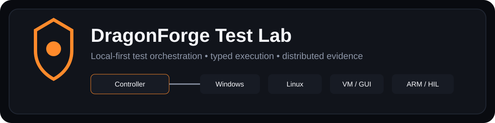
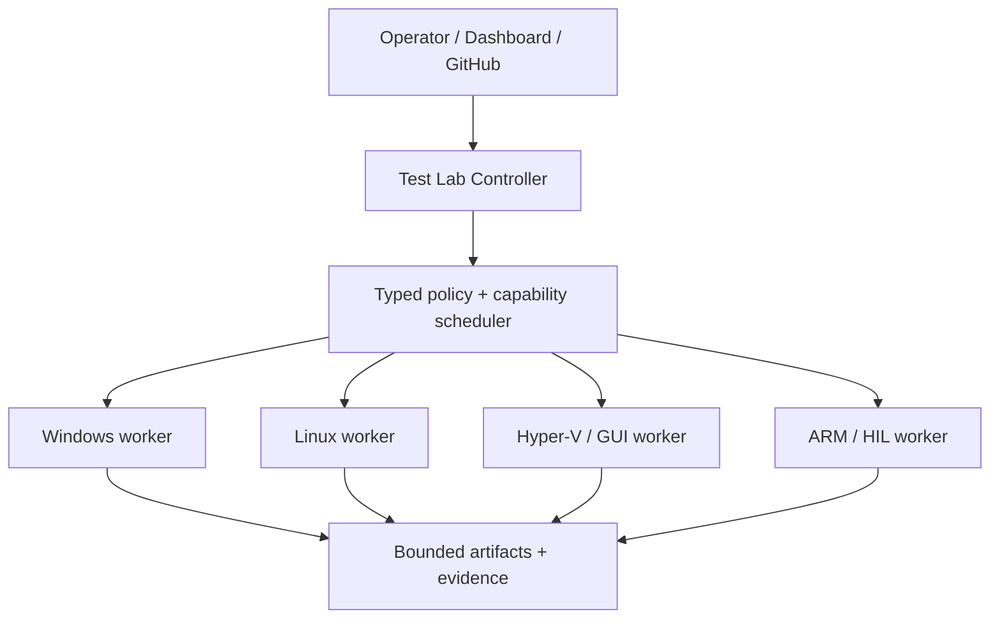

# DragonForge Test Lab

<p align="center">
  
</p>

DragonForge Test Lab is a local-first test orchestration platform for validation work that conventional hosted CI cannot conveniently cover. It is built for projects that need real operating systems, disposable virtual machines, containers, GUI interaction, distributed workers, physical ARM devices, hardware-in-the-loop checks, long-running services, and reproducible evidence from those environments.

> **Status:** Phase 25 dogfooding is complete and the Windows path is qualified. Linux, ARM, VM, distributed, GUI, release, security-review, and other capabilities have separate qualification procedures documented in the repository.

## What problem it solves

Hosted CI is excellent for ordinary build and unit-test workloads, but it is a poor fit for some of the environments DragonForge projects need to exercise. Test Lab provides one typed orchestration layer across local and distributed resources so a test plan can target the right execution environment without turning every validation workflow into one-off shell automation.

Major capabilities include:

- native Windows and Linux workers;
- Windows Job Object and Linux process-group/resource containment;
- Docker/Podman execution;
- Hyper-V disposable virtual-machine workflows;
- Windows GUI automation;
- Raspberry Pi/ARM inventory and bounded hardware-in-the-loop probes;
- authenticated distributed execution and worker lifecycle management;
- mTLS/X.509 node identity and revocation;
- durable SQLite-backed controller state and recovery;
- declarative test plans, retries, artifacts, audit logs, and observability;
- GitHub-aware test selection and immutable revision execution;
- Rust fuzzing, sanitizer, coverage, benchmark, and deep-test lanes;
- a loopback-only operator dashboard and authenticated MCP gateway;
- release packaging, installation, rollback, SBOM, and qualification tooling;
- dogfooding campaigns that run Test Lab against DragonForge repositories.

## Architecture

The repository separates protocol, policy, execution, platform integration, identity, orchestration, and operator surfaces into Rust crates rather than placing everything in one controller binary.

```text
apps/dragonforge-test-lab/   operator application / CLI
crates/                      protocol, policy, controller, workers, sandboxing,
                             VM, GUI, distributed, identity, plans, intelligence,
                             observability, release, security review, and dogfood
containers/                  isolated worker image definitions
dogfood/                     checked-in project/campaign profiles
docs/                        architecture, setup, security, roadmap, phase records
scripts/                     validation, packaging, install/rollback, release tooling
```

The controller does not treat worker claims as authority. Capability, identity, policy, and execution boundaries are modeled explicitly, and higher-risk operations remain opt-in or environment-gated.

### Distributed lab at a glance



See [Architecture](docs/ARCHITECTURE.md) and [Security Model](docs/SECURITY.md).

### Screenshots

The current tree does not contain a dedicated public screenshot pack, and this connector environment cannot safely run the real dashboard/worker stack. No screenshot is fabricated. The required synthetic dashboard, run-detail, and worker-inventory captures are specified in [Public Screenshot Capture](docs/PUBLIC_SCREENSHOT_CAPTURE.md).

## Quick start

For a complete host setup—including Hyper-V, Windows and Ubuntu images, Docker, distributed workers, dashboard/MCP, release tooling, backups, and troubleshooting—use the [Setup Guide](docs/SETUP-GUIDE.md).

A source checkout can start with normal Rust validation:

```powershell
cargo fmt --all --check
cargo clippy --workspace --all-targets --all-features -- -D warnings
cargo test --workspace --all-features
```

The checked-in dogfood campaign can be validated with:

```powershell
cargo run -p dragonforge-test-lab -- dogfood-campaign-validate --campaign .\dogfood\phase25-campaign.json
```

On Windows, the Phase 25 qualification entry point is:

```powershell
.\scripts\test-phase25.ps1
```

Do not assume every capability is available on every host. Hyper-V, GUI automation, privileged Windows fixtures, ARM/HIL, container runtimes, and external project campaigns have explicit prerequisites and manual boundaries.

## Safety and limitations

Test Lab is designed to make environment-sensitive testing more controlled, not to erase the risks of running destructive or privileged tests.

- VM and hardware workflows require correctly prepared disposable or dedicated environments.
- Some Windows integration checks require elevation; they are not silently promoted to administrator operations.
- GUI tests depend on an interactive desktop and are not equivalent to headless unit tests.
- Physical-device and hardware-in-the-loop checks depend on the capabilities actually reported by enrolled nodes.
- Test Intelligence is a targeting/orchestration aid; it does not replace explicit project policy or human review.
- External repositories and revisions are resolved to immutable commits for execution, but operators remain responsible for what they authorize the lab to run.
- Manual-only validation boundaries are documented instead of being represented as automated passes.

A historical author/committer metadata privacy issue identified by the public-readiness audit remains a publication blocker pending owner decision or coordinated history remediation. The sensitive mailbox value is intentionally not reproduced here.

## Documentation

- [Setup Guide](docs/SETUP-GUIDE.md) — start-to-finish Windows/Linux lab setup
- [Architecture](docs/ARCHITECTURE.md) — crate boundaries and execution model
- [Security Model](docs/SECURITY.md) — authorization, isolation, identity, artifacts, and trust boundaries
- [Roadmap](docs/ROADMAP.md) — complete implementation history and current roadmap
- [Hyper-V Host Setup](docs/HOST-SETUP-HYPERV.md) — Windows VM prerequisites
- [Dogfood Manual Validation](docs/DOGFOOD-MANUAL-VALIDATION.md) — manual qualification boundaries
- [Public Screenshot Capture](docs/PUBLIC_SCREENSHOT_CAPTURE.md) — synthetic-data capture and sanitization requirements
- [Future Plans](docs/FUTURE-PLANS.md) — concepts intentionally outside the active numbered roadmap
- [Third-party notices](THIRD_PARTY_NOTICES.md) — dependency and container redistribution notes
- [`docs/`](docs/) — Phase 0–25 engineering and validation records

The detailed phase chronology remains in the roadmap and phase documents. The root README is intentionally focused on what the system is and how to evaluate it.

## Personal / Portfolio Use Disclaimer

This repository is maintained for my personal projects, learning, evaluation, authorized testing, and portfolio demonstration. It is not intended or offered as a commercial product, managed service, professional consulting service, certification, warranty, or guarantee of fitness for any particular purpose.

Any third party who chooses to compile, run, adapt, evaluate, or otherwise use material from this repository does so entirely at their own risk and is responsible for ensuring that their use is lawful, authorized, appropriate for their environment, and compliant with applicable licenses and third-party terms.

To the maximum extent permitted by applicable law, I assume no responsibility or liability for loss, damage, data loss, service interruption, security incidents, system changes, misuse, legal or regulatory consequences, or any other outcome arising from another person's use of or reliance on this repository or its materials.

This disclaimer does not expand the permissions granted by the repository's license. The licensing terms below continue to control whether and how the material may be used.

## Licensing

Copyright © 2026 David James. All rights reserved.

Original DragonForge material in this repository is **source-visible, not open source** and uses `LicenseRef-DragonForge-Proprietary` for DragonForge workspace packages. Except for rights expressly required by GitHub's Terms of Service for public repositories, no general permission is granted to use, copy, modify, redistribute, sublicense, sell, commercially exploit, or incorporate original DragonForge material into another work.

See [LICENSE](LICENSE) for the full notice. Third-party dependencies and container contents retain their own rights and obligations; see [THIRD_PARTY_NOTICES.md](THIRD_PARTY_NOTICES.md).

Before public release, the exact locked Cargo dependency graph still requires owner-side license review, and public container redistribution must account for the licenses/notices of the Rust official image and Debian Bookworm contents actually distributed.
