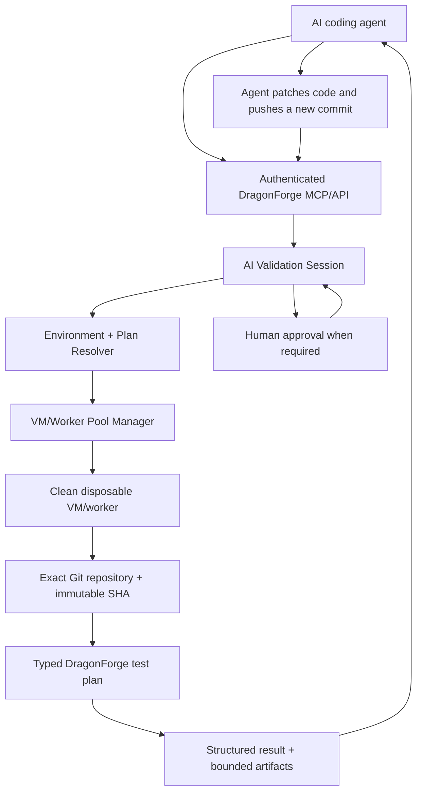
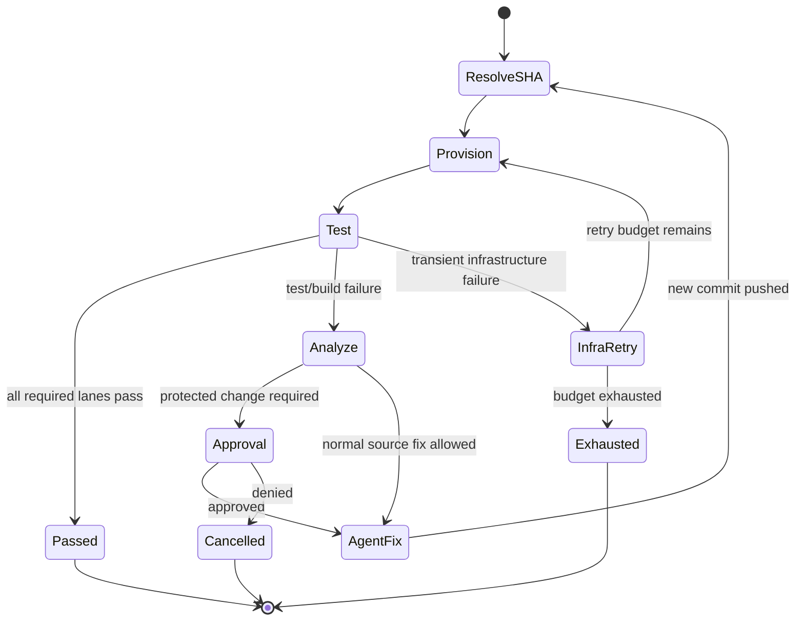

# Future Plans

> This document is **not part of the active DragonForge Test Lab phase roadmap**. It records a future design direction so the architecture, security constraints, and implementation sequence are ready when the project is mature enough to pursue it.

## AI-Driven Closed-Loop Validation and Repair

### Vision

The long-term goal is to let an authenticated AI coding agent—such as ChatGPT or another MCP-capable engineering agent—request a test run against a specific repository revision, have DragonForge automatically provision the correct clean test environment, execute the appropriate bounded test plan, return structured results and artifacts, and support a controlled fix/retest loop until the required validation passes or a safety/iteration limit is reached.

The desired workflow is:



The agent should never need direct Hyper-V, PowerShell, SSH, or shell access to the test machine.

DragonForge should remain the authority that decides:

- what environment is required;
- what VM/worker is eligible;
- which repository/revision may be tested;
- what typed actions are allowed;
- what artifacts may be returned;
- whether another iteration is allowed;
- whether human approval is required.

---

# 1. Core design principles

The future system should preserve the security model already established by DragonForge.

## 1.1 No generic remote shell

The AI interface must not add:

- arbitrary shell text;
- arbitrary PowerShell;
- arbitrary executable paths;
- arbitrary command-line arguments;
- unrestricted SSH;
- generic remote desktop control;
- arbitrary filesystem browsing;
- arbitrary registry/network/device mutation.

The AI should request **high-level typed operations**, and DragonForge should translate those requests into existing or newly defined bounded execution primitives.

Examples of acceptable high-level requests:

- run stored test plan;
- request Windows GUI environment;
- request Ubuntu container environment;
- restore clean baseline;
- get job status;
- retrieve structured failure summary;
- retrieve a named bounded artifact;
- cancel a validation session.

## 1.2 Immutable source revisions

Every test iteration should resolve the requested branch/ref to an immutable commit SHA before execution.

The VM/worker should test that exact SHA.

The agent should never assume that a moving branch name still points to the same code after a test begins.

## 1.3 Disposable environments by default

Destructive, installer, GUI, privileged, and integration testing should use disposable or baseline-restored environments wherever practical.

The preferred lifecycle is:

```text
allocate environment
-> restore/create clean baseline
-> boot
-> wait for authenticated worker
-> checkout exact SHA
-> run test plan
-> collect result/artifacts
-> restore/destroy
```

## 1.4 Human control over high-risk changes

The repair loop must stop for explicit approval when proposed changes affect protected areas or policy boundaries.

Examples:

- security policy;
- audit configuration;
- release/signing policy;
- test harnesses;
- CI/release gates;
- production infrastructure configuration;
- trust stores;
- identity/certificate policy;
- files designated protected by repository policy.

## 1.5 Auditable autonomy

Every automated decision should be persisted:

- session ID;
- repository;
- branch/ref;
- resolved SHA;
- requested plan;
- chosen environment;
- test result;
- failure classification;
- artifacts returned;
- next action;
- agent iteration number;
- approval events;
- stop reason.

The existing durable controller and hash-chained audit history are natural foundations for this.

---

# 2. Target end-to-end workflow

A future autonomous validation session could look like this:

```text
1. Agent creates validation session.
2. DragonForge validates repository allowlist.
3. DragonForge resolves branch/ref to immutable SHA.
4. Test Intelligence and stored plan metadata determine required lanes.
5. Environment resolver maps requirements to a VM/worker profile.
6. VM Pool Manager restores or creates an eligible clean environment.
7. DragonForge waits for authenticated mTLS worker readiness.
8. Worker fetches repository and checks out the exact SHA.
9. Typed test plan runs.
10. Logs, test failures, screenshots, reports, and metadata are collected.
11. Controller creates a structured failure report.
12. AI receives the failure report and explicitly allowed artifacts.
13. AI edits code using its repository integration.
14. AI pushes a new commit.
15. DragonForge resolves the new SHA and repeats.
16. Session ends when:
    - required plans pass;
    - iteration/time/resource limit is reached;
    - protected-path approval is required;
    - failure is classified as infrastructure/unrecoverable;
    - operator cancels the session.
```

---

# 3. Proposed future architecture

## 3.1 AI Validation Session

Introduce a durable top-level session object.

Example conceptual record:

```json
{
  "session_id": "uuid",
  "repository": "https://github.com/example/project",
  "target_branch": "ai/fix-issue-184",
  "current_sha": "40-character-sha",
  "goal": "required plans pass",
  "mode": "assisted",
  "max_iterations": 8,
  "max_wall_time_seconds": 7200,
  "allowed_environment_profiles": [
    "windows-standard",
    "ubuntu-standard"
  ],
  "protected_paths": [
    ".github/",
    "security/",
    "deny.toml"
  ],
  "auto_merge": false
}
```

This should be persisted in the durable controller.

Suggested states:

```text
created
resolving
provisioning
waiting_for_worker
testing
failed_waiting_for_agent
waiting_for_approval
retesting
passed
cancelled
expired
exhausted
infrastructure_error
```

The session should own the relationship between multiple test jobs and multiple source revisions.

---

## 3.2 Environment profiles

Create named environment profiles rather than letting an agent specify raw VM configuration.

Examples:

```text
windows-standard
windows-gui
windows-installer
windows-privileged
ubuntu-standard
ubuntu-docker
ubuntu-deep-rust
linux-network
arm-readonly
```

Each profile would define fixed, operator-controlled values such as:

- guest OS;
- base image;
- Hyper-V generation;
- CPU count;
- memory;
- switch/network class;
- required worker capabilities;
- allowed test plans;
- baseline checkpoint policy;
- keep-warm vs destroy-after-use behavior;
- privilege class;
- maximum job duration.

The AI may request a profile or required capabilities, but it should not supply arbitrary host paths or VM PowerShell.

---

## 3.3 VM/Worker Pool Manager

Add a controller-owned pool abstraction on top of the existing Hyper-V VM layer and worker-service inventory.

A pool entry might track:

- VM name;
- environment profile;
- base image identity;
- checkpoint identity;
- current state;
- worker ID;
- worker mTLS identity;
- last heartbeat;
- current lease;
- last reset time;
- health state;
- current session/job;
- dirty/clean status.

Candidate states:

```text
offline
booting
ready
leased
resetting
unhealthy
quarantined
destroying
```

Pool behavior:

### Warm-pool mode

Keep a small number of baseline-ready VMs available.

Benefits:

- faster test startup;
- useful for frequent development loops.

Lifecycle:

```text
ready -> leased -> test -> reset -> ready
```

### Ephemeral mode

Create from the golden image only when needed.

Benefits:

- stronger cleanliness guarantee;
- simpler contamination reasoning.

Lifecycle:

```text
create -> boot -> test -> destroy
```

The operator should choose policy per environment profile.

---

# 4. Repository synchronization

The worker should never trust a stale working directory.

For every iteration:

1. validate repository URL;
2. resolve ref through the GitHub integration;
3. obtain immutable commit SHA;
4. create/clean a job workspace;
5. fetch repository using fixed Git argument vectors;
6. checkout detached SHA;
7. verify current HEAD equals expected SHA;
8. run typed test plan.

The existing GitHub resolution and local executor mechanisms should remain authoritative.

No AI-controlled arbitrary Git arguments should be introduced.

---

# 5. Test-plan resolution

The future orchestration layer should combine:

- explicit agent request;
- stored Phase 16 plans;
- Phase 10/17 Test Intelligence;
- repository policy;
- environment capabilities.

Example:

```text
changed:
  crates/df-test-gui/**
  scripts/install-windows.ps1

recommended:
  rust_standard
  gui_automation
  windows_installer

required environments:
  windows-gui
  windows-installer
```

The AI can ask DragonForge to validate a revision, but DragonForge should be able to determine that multiple lanes are required.

A session may therefore contain a validation matrix rather than one job.

Example:

```text
Windows standard       PASS
Windows GUI            PASS
Windows installer      FAIL
Ubuntu standard        PASS
```

The session remains failed until all required lanes pass.

---

# 6. Structured result model

The AI needs more than a single pass/fail string, but should not receive unrestricted filesystem access.

Add a structured result object.

Conceptual example:

```json
{
  "job_id": "uuid",
  "session_id": "uuid",
  "repository": "https://github.com/example/project",
  "commit": "40-character-sha",
  "environment": "windows-installer",
  "plan": "windows-release-qualification",
  "status": "failed",
  "failure_class": "test_failure",
  "failed_step": "installer_upgrade_fixture",
  "summary": "Upgrade state assertion failed",
  "failures": [
    {
      "test": "upgrade_preserves_state",
      "message": "expected schema_version 4, got 3"
    }
  ],
  "artifacts": [
    {
      "artifact_id": "uuid",
      "kind": "test_log",
      "name": "phase-validation.log",
      "sha256": "..."
    }
  ]
}
```

Results should distinguish:

- test failure;
- build failure;
- policy rejection;
- environment unavailable;
- infrastructure/transient failure;
- timeout;
- cancelled;
- malformed test input;
- worker identity/authentication failure.

This distinction is essential for deciding whether the AI should patch code, retry infrastructure, or stop.

---

# 7. Bounded artifact retrieval

The current MCP layer exposes artifact metadata only.

A future AI validation API will likely need tightly controlled artifact-content retrieval.

The design should remain bounded.

Potential artifact types:

- test log;
- compiler output;
- structured JSON report;
- screenshot;
- coverage summary;
- benchmark summary;
- audit excerpt;
- crash report.

Required controls:

- artifact must belong to a known job/session;
- canonical path containment;
- maximum artifact size;
- maximum total download bytes per request/session;
- no arbitrary path input;
- content type allowlist;
- optional text truncation;
- explicit binary artifact handling;
- SHA-256 verification.

Do not add a generic "read file" API.

---

# 8. Failure summarization

Large logs should be converted into a bounded structured failure summary before being returned to an AI agent.

Potential pipeline:

```text
raw log
-> redact secrets
-> identify failing command/test
-> extract bounded context
-> normalize paths/IDs
-> classify failure
-> attach relevant artifacts
-> return structured report
```

Where practical, parsing should be deterministic.

Examples:

- Rust compiler diagnostic JSON;
- cargo test failures;
- Clippy diagnostics;
- cargo-audit findings;
- cargo-deny failures;
- PowerShell validation step failures;
- known DragonForge validation-script markers.

An AI model may interpret the already bounded result, but security-relevant redaction should not depend on the AI.

---

# 9. AI-facing MCP/API expansion

The current MCP interface is a strong starting point.

Future tools could include concepts such as:

```text
dragonforge_validation_session_create
dragonforge_validation_session_status
dragonforge_validation_session_cancel
dragonforge_validation_run
dragonforge_validation_result
dragonforge_validation_artifact_get
dragonforge_validation_approve
dragonforge_environment_status
```

The final names may differ.

Important: avoid exposing primitive tools like:

```text
run_command
powershell
ssh_exec
vm_exec
read_file
write_file
```

The AI should operate at the orchestration level.

---

# 10. Autonomous repair loop

The repair loop should be managed as a state machine, not an unbounded AI conversation.

Conceptual flow:



The AI should be responsible for source changes through its normal repository integration.

DragonForge should remain responsible for:

- source revision identity;
- test execution;
- environment lifecycle;
- result integrity;
- audit history;
- approval enforcement;
- iteration limits.

DragonForge should not become a generic source-code editing engine.

---

# 11. Session safety limits

Every autonomous session should have hard limits.

Recommended controls:

- maximum iterations;
- maximum wall-clock duration;
- maximum total test jobs;
- maximum VM boots/restores;
- maximum total artifact bytes returned;
- maximum concurrent environments;
- maximum changed files per iteration;
- maximum diff size;
- repository allowlist;
- branch restrictions;
- protected-path rules;
- approval-required operations;
- no automatic merge by default.

Example:

```text
max_iterations = 8
max_wall_time = 2h
max_jobs = 30
max_concurrent_environments = 2
max_artifact_download = 100 MiB
auto_merge = false
```

---

# 12. Protected-path policy

A repository should be able to define files that an autonomous repair session may not modify without approval.

Example categories:

- .github/workflows/
- deny.toml
- security policy
- DragonForge validation scripts
- test expected-value fixtures
- release signing configuration
- deployment configuration
- trust roots
- policy allowlists

Policies should support:

```text
allowed
approval_required
forbidden
```

This is important because an automated agent must not "fix" a failing build by deleting or weakening the test/security mechanism.

---

# 13. Anti-gaming protections

The system should explicitly detect suspicious pass-seeking behavior.

Examples that should trigger review:

- deleting failing tests;
- replacing assertions with unconditional success;
- changing expected output only to match the current bug;
- removing cargo-audit/cargo-deny;
- lowering lint severity;
- disabling test lanes;
- altering protected validation scripts;
- increasing retry limits to hide nondeterminism;
- weakening certificate/repository/sandbox policy.

DragonForge does not need perfect semantic detection initially.

A practical first version can rely on:

- protected paths;
- diff classification;
- required-plan invariants;
- minimum test-count/plan expectations;
- human approval.

---

# 14. Approval workflow

Approval should be a first-class durable action.

Possible approval reasons:

- protected path changed;
- privileged environment requested;
- destructive hardware test;
- signing/release policy changed;
- session exceeded normal bounds;
- proposed merge;
- repository policy requires human review.

An approval record should include:

- session ID;
- requested action;
- requesting agent identity;
- diff/commit SHA;
- reason;
- approver;
- timestamp;
- decision;
- audit-chain entry.

---

# 15. Agent identity and authorization

Future multi-agent use should distinguish identities.

Examples:

```text
coding-agent
security-review-agent
release-agent
human-operator
```

Permissions should be role-based.

Example:

### Coding agent

May:

- start validation session;
- retrieve test results;
- retrieve bounded logs;
- request retest.

May not:

- approve protected changes;
- alter environment definitions;
- change trust roots;
- publish releases.

### Security review agent

May:

- inspect diff metadata;
- request security plans;
- inspect security-result artifacts.

May not automatically approve its own protected changes.

### Human operator

May approve or deny protected actions.

This separation prevents one compromised agent credential from owning the entire pipeline.

---

# 16. VM readiness and worker handshake

Provisioning must not assume a VM is usable merely because Hyper-V reports Running.

A clean readiness sequence should be:

```text
VM started
-> authenticated worker connects outbound
-> worker certificate/identity validated
-> environment profile matches expected worker capabilities
-> heartbeat received
-> pool lease confirmed
-> job dispatch allowed
```

Timeout at any step should quarantine or recycle the environment.

The worker identity should be associated with the VM pool entry to prevent a different node from claiming the lease.

---

# 17. Environment reset verification

A VM restore should be verified, not assumed.

Potential checks:

- expected checkpoint ID;
- expected base-image fingerprint/version;
- worker startup generation;
- workspace root empty/clean;
- no previous job lease;
- correct environment profile;
- expected toolchain versions.

If reset verification fails:

```text
environment -> quarantined
```

The controller should allocate another environment rather than run potentially contaminated work.

---

# 18. Environment image versioning

Golden images should eventually have explicit metadata.

Example:

```json
{
  "image_id": "windows-standard-2026-09",
  "os": "windows",
  "os_version": "11",
  "architecture": "x86_64",
  "toolchain": {
    "rust": "1.98.1",
    "git": "2.54.0",
    "powershell": "5.1"
  },
  "capabilities": [
    "windows_integration",
    "gui_automation"
  ]
}
```

The session audit should record which image version produced each result.

This makes historical test results reproducible.

---

# 19. Scheduling strategy

The scheduler should consider:

- required OS;
- required capabilities;
- environment profile;
- VM availability;
- worker health;
- current load;
- warm vs ephemeral policy;
- memory/CPU limits;
- session priority;
- network isolation requirement.

A future scoring model might prefer:

1. already-ready matching VM;
2. idle VM requiring restore;
3. new ephemeral VM;
4. remote physical worker.

Security restrictions should always override performance preference.

---

# 20. Parallel validation

A future session should support independent lanes in parallel.

Example:

```text
                +-> Windows standard ----+
commit SHA -----+-> Windows GUI ---------+--> aggregate result
                +-> Ubuntu standard -----+
                +-> Ubuntu Docker -------+
```

Dependent lanes should still honor plan DAGs.

The aggregate session result should not become Pass until every required lane passes.

---

# 21. Result aggregation

Session-level status should summarize all required environments.

Example:

```json
{
  "session_status": "failed",
  "commit": "abc...",
  "lanes": [
    {"name":"windows-standard","status":"passed"},
    {"name":"windows-gui","status":"passed"},
    {"name":"ubuntu-standard","status":"failed"}
  ],
  "blocking_lane": "ubuntu-standard"
}
```

This makes it easy for an AI agent to focus only on blocking failures.

---

# 22. Infrastructure retry versus source-code retry

The system must distinguish two loops.

## Infrastructure loop

Examples:

- VM failed to boot;
- worker heartbeat timeout;
- transient network failure;
- container runtime temporarily unavailable.

DragonForge may retry this automatically under bounded lifecycle policy.

## Source-code loop

Examples:

- compile error;
- failing unit test;
- Clippy error;
- installer assertion failure.

DragonForge returns the result to the coding agent.

The coding agent creates a new commit.

DragonForge should never "retry until green" the same deterministic source failure without a reason.

---

# 23. Suggested implementation stages

This future initiative should be built incrementally.

## Stage A — Structured AI test result API

Goal: make the existing AI-triggered testing loop substantially more useful without VM automation.

Deliverables:

- durable validation-session record;
- structured job result schema;
- failure classification;
- bounded log excerpts;
- bounded artifact-content retrieval;
- MCP tools for session/result/artifact access;
- audit records;
- repository/session limits.

Exit criteria:

- AI agent can submit an approved plan;
- exact SHA is recorded;
- AI receives a structured failure;
- AI can retrieve one explicitly permitted artifact;
- no arbitrary file/shell access is added.

---

## Stage B — Environment profile registry

Goal: define operator-controlled execution environments.

Deliverables:

- environment-profile schema;
- fixed Windows/Linux profile definitions;
- profile capability mapping;
- base-image/checkpoint metadata;
- privilege class;
- network class;
- plan compatibility;
- profile validation;
- operator CLI.

Exit criteria:

- a plan can resolve to an environment profile;
- invalid/unsafe profiles fail closed;
- AI cannot inject raw Hyper-V configuration.

---

## Stage C — VM Pool Manager

Goal: automatically allocate clean Hyper-V environments.

Deliverables:

- VM pool state;
- warm and ephemeral policies;
- create/start/restore/destroy orchestration;
- environment leases;
- worker-ID binding;
- boot/readiness timeout;
- unhealthy/quarantine state;
- durable audit.

Exit criteria:

- controller can allocate a clean Windows VM automatically;
- controller waits for authenticated worker;
- environment is restored/destroyed after test;
- contaminated/unhealthy VM is never silently reused.

---

## Stage D — Automated repository bootstrap

Goal: make VM workers fully self-preparing per job.

Deliverables:

- exact-SHA fetch/checkout workflow;
- clean job workspace;
- revision verification;
- GitHub auth strategy for private repos;
- no credentials persisted into golden images;
- checkout audit metadata.

Exit criteria:

- freshly restored VM can receive repository + SHA and run a typed test with no manual login/setup.

---

## Stage E — Multi-lane validation sessions

Goal: test one commit across all required environments.

Deliverables:

- session validation matrix;
- parallel independent lanes;
- plan dependency handling;
- aggregate result;
- blocking-lane identification;
- environment reservation limits.

Exit criteria:

- one request can validate Windows and Linux lanes;
- session remains failed until all required lanes pass;
- results remain independently inspectable.

---

## Stage F — Protected-path and approval policy

Goal: establish safe autonomy before repair looping.

Deliverables:

- repository automation policy;
- allowed/approval-required/forbidden path rules;
- diff-size/change-count limits;
- approval records;
- MCP/operator approval action;
- immutable audit entries;
- explicit no-auto-merge default.

Exit criteria:

- protected changes cannot proceed without human approval;
- forbidden changes stop the session;
- approval decisions are durable and auditable.

---

## Stage G — Agent repair loop

Goal: support bounded repeated patch/test cycles.

Deliverables:

- iteration tracking;
- current source SHA;
- retry/fix state machine;
- stop conditions;
- agent handoff/result protocol;
- session budget enforcement;
- infrastructure/source failure separation.

Exit criteria:

- AI can patch/push a new commit;
- DragonForge automatically retests the new SHA;
- loop stops on pass, approval, exhaustion, cancellation, or infrastructure fault.

---

## Stage H — Intelligent plan/environment selection

Goal: automatically determine which validation lanes are required.

Deliverables:

- Phase 17 intelligence integration;
- environment-capability matching;
- historical regression weighting;
- minimum required-plan policy;
- explainable decision output.

Exit criteria:

- changed files can result in a reproducible, explainable validation matrix;
- automation cannot silently omit required policy lanes.

---

## Stage I — Multi-agent engineering workflows

Goal: support distinct coding/review/security/release agents.

Deliverables:

- agent identities;
- role-scoped permissions;
- separate review and approval roles;
- session handoff;
- per-agent audit attribution.

Exit criteria:

- coding agent cannot approve its own protected action;
- security/release roles can request appropriate tests without gaining shell access.

---

## Stage J — Production hardening

Goal: make autonomous sessions reliable enough for long-running real development use.

Deliverables:

- chaos testing;
- VM leak detection;
- stale lease recovery;
- controller restart recovery;
- session resumption;
- resource accounting;
- artifact retention policy;
- metrics/dashboard visibility;
- backup/recovery procedures;
- security review.

Exit criteria:

- controller restart does not lose session state;
- orphaned VMs/jobs are detected and reconciled;
- all autonomous actions remain bounded and auditable.

---

# 24. Example future operator policy

Conceptual example only:

```yaml
repository: https://github.com/djames1987/example-project

automation:
  max_iterations: 8
  max_wall_time_minutes: 120
  max_jobs: 30
  auto_merge: false

environments:
  allowed:
    - windows-standard
    - windows-gui
    - ubuntu-standard

protected_paths:
  approval_required:
    - ".github/**"
    - "deny.toml"
    - "security/**"
    - "scripts/test-*.ps1"
    - "scripts/test-*.sh"

  forbidden:
    - "signing/private/**"

required_plans:
  always:
    - rust_standard

  on_windows_changes:
    - windows_integration

  on_gui_changes:
    - gui_automation
```

The real schema should be versioned, bounded, and parsed by DragonForge rather than passed to a shell.

---

# 25. Example future AI interaction

An MCP-capable agent might conceptually perform:

```text
create validation session
repository = DragonForge-Security-Suite
branch = ai/fix-network-guard
goal = required validation passes

DragonForge:
resolved SHA = a1b2...
required lanes:
- windows-standard
- windows-integration

DragonForge provisions Windows VM.
Tests run.

Result:
windows-standard = pass
windows-integration = fail
failure = service fixture expected state mismatch

Agent patches code and pushes commit b2c3...

DragonForge retests b2c3...
both lanes pass

Session status:
PASSED
merge still requires operator action
```

The AI does not need to know the Hyper-V VM name, checkpoint path, worker certificate, or PowerShell commands.

---

# 26. Dashboard additions

If this future system is implemented, the read-only dashboard could gain visibility for:

- validation sessions;
- current iteration;
- current SHA;
- requested/required lanes;
- allocated environments;
- test progress;
- blocking failures;
- approval requests;
- resource usage;
- session history.

The dashboard should remain read-only unless a separately reviewed operator-action interface is deliberately introduced.

---

# 27. Security review checklist before enabling autonomous repair

Before enabling autonomous repair in a real repository, verify:

- AI cannot issue generic commands;
- repository allowlist is enforced;
- immutable SHA execution is enforced;
- environment profiles are operator-controlled;
- worker identity is mTLS bound;
- VM leases cannot be hijacked;
- artifact retrieval is bounded;
- secrets are redacted before AI access;
- protected-path rules work;
- approval cannot be bypassed;
- iteration/time/job budgets are enforced;
- test/security gates cannot be silently removed;
- audit events cover the entire session;
- auto-merge is disabled unless explicitly designed and reviewed;
- controller restart recovery is safe;
- orphaned VM cleanup works;
- rollback/recovery procedures are documented.

---

# 28. What already exists today

This future design can build on current DragonForge capabilities rather than starting from zero.

Existing foundations include:

- typed test actions;
- policy and capability enforcement;
- fixed repository checkout behavior;
- immutable GitHub SHA resolution;
- Hyper-V VM creation/start/stop/baseline/restore/destroy;
- Windows and Linux workers;
- container sandboxing;
- authenticated distributed nodes;
- MCP gateway;
- deterministic Test Intelligence;
- durable SQLite controller state;
- mTLS/X.509 node identity;
- long-running worker services;
- hash-chained audit history;
- artifact metadata;
- retry/lifecycle control;
- declarative test plans;
- intelligence integration;
- read-only dashboard;
- installer/release qualification infrastructure.

The largest missing pieces are orchestration glue rather than fundamental test execution.

---

# 29. Major risks

## Scope growth

This feature can easily become a complete autonomous software-development platform.

Mitigation: keep DragonForge focused on **safe orchestration and validation**, not source editing.

## AI trying to game tests

Mitigation:

- protected paths;
- policy-required tests;
- approval gates;
- immutable audit;
- no auto-merge by default.

## VM contamination

Mitigation:

- baseline restore verification;
- ephemeral environments;
- leases;
- quarantine state;
- environment image versioning.

## Credential leakage

Mitigation:

- no secrets in golden images;
- bounded/redacted artifact retrieval;
- separate GitHub/service credentials;
- existing private-key handling rules.

## Infinite loops / resource exhaustion

Mitigation:

- iteration budget;
- job budget;
- wall-clock budget;
- environment concurrency caps;
- lifecycle cancellation.

## Trust-boundary erosion

Mitigation:

- never add generic shell/SSH/PowerShell tools for AI;
- all new actions remain typed and policy-controlled.

---

# 30. Definition of success

The future feature can be considered successful when a developer can:

1. ask an authenticated AI agent to validate a repository branch;
2. have DragonForge resolve the exact commit;
3. automatically select and prepare the required clean Windows/Linux environment;
4. run the correct typed validation plan;
5. receive structured, bounded failure evidence;
6. let the coding agent patch and push a new commit;
7. automatically retest the new commit;
8. repeat within strict limits;
9. require human approval for protected/high-risk changes;
10. finish with a complete audit history showing exactly what was tested, changed, and approved.

The final experience should feel simple to the agent:

```text
"Validate this branch and keep fixing normal source defects until all required tests pass."
```

while the implementation underneath remains explicit, bounded, reproducible, authenticated, and auditable.

---

## Status

**Future concept only.**

This document does not create a new numbered phase, change the active roadmap, or authorize implementation. It exists so the design is ready for future planning when the current roadmap and project maturity make the feature appropriate.
